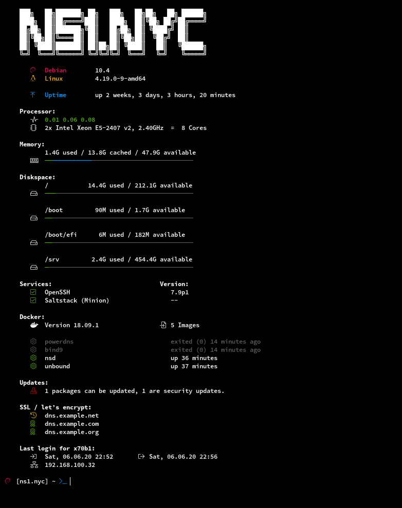

# motd-on-acid

[](https://github.com/x70b1/motd-on-acid/actions)
[](https://github.com/x70b1/motd-on-acid/graphs/contributors)
[](https://github.com/x70b1/motd-on-acid/blob/master/LICENSE)

This MOTD has so many colors! This thing is from hell.
It is both a curse and a blessing.

It's colourful. It shows a lot. It's fun.
But I guess we have reached the limit.
The execution is sometimes too slow.
It makes it annoying when you log in.
So be careful.
I warned you.


## Preview



The most of the icons in this preview are from Font Awesome 5 Pro.
I also used [fontello](http://fontello.com/) to create some own icons.


## Setup

1. Check the dependencies.
Some modules require `jq`, the banner needs `figlet`.
Install them.

2. Copy `motd-on-acid.sh` to `~/.bashrc_motd` on your system.

3. Run `motd-on-acid` at the end of your `.bashrc`.
Add the modules as arguments.
The output is ordered in the same way.

4. Replace the predefined values with your own.
The complete list of vars is [at the top](motd-on-acid.sh#L4) of the script.

```
# example snippet for your .bashrc:

source ~/.bashrc_motd

BANNER_KERNEL_ICON="X"
BANNER_UPTIME_ICON="Y"
BANNER_DEBIAN_ICON="Z"

bash_motd --banner --processor --memory
```


### Make it better

If you use the example above you will get some problems.

1. You only want to see `motd-on-acid` if you login with `ssh` on an interactive shell.

2. You need a way to disable it sometimes.

The result would look like this:

```
# example snippet for your .bashrc:

if [ -n "$SSH_CONNECTION" ] && [ $SHLVL -eq 1 ] && [[ $- == *i* ]]; then
    if [ -z "$MOTD" ] || [ "$MOTD" -ne 0 ]; then
        source ~/.bashrc_motd

        BANNER_KERNEL_ICON="X"
        BANNER_UPTIME_ICON="Y"
        BANNER_DEBIAN_ICON="Z"

        bash_motd --banner --processor --memory
    fi
fi
```

Also add `AcceptEnv MOTD` to your `/etc/ssh/sshd_config`.

Now you can run `export MOTD=0; ssh -o SendEnv=MOTD -t host.name.net` to disable MOTD.
That is useful if you run `ssh` commands in scripts.


### Remove other output

You still have disturbing output which is not required.

Change some values in your `/etc/ssh/sshd_config`:

```
PrintMotd no
PrintLastLog no
Banner none
```

Disable or remove all `pam_motd.so` PAM includes in `/etc/pam.d/sshd`

```
# session    optional     pam_motd.so
```


## Modules

### --banner

Prints a `figlet` banner, linux distribution, kernel version and uptime.


### --processor

Prints the loadavg threshold and hardware info.


### --memory

Prints a usage bar for your memory.


### --swap

Prints a usage bar as summary for your swap space.


### --diskspace

Prints a usage bar for all mounted filesystems.


### --services

Prints the status of a defined list of systemd services.

The default file is `.bashrc_motd_services.txt`.
It should look like the example. The separator is`;`.

1. The printed name [required]
2. `systemd` service name [required]
3. `dpkg` or `rpm` package name for version info [not required, will print `--` if empty]

```
OpenSSH;ssh;openssh-server
Webserver;nginx
```


### --docker

Prints the status of your local `docker` containers.

You have to add `curl` to the `/etc/sudoers` for your user:

```ini
username ALL=(ALL) NOPASSWD: /usr/bin/curl -sf --unix-socket /var/run/docker.sock http\:/v1.40/info
username ALL=(ALL) NOPASSWD: /usr/bin/curl -sf --unix-socket /var/run/docker.sock http\:/v1.40/containers/json?all=true
```


### --updates

Prints your available linux distribution updates.
`apt` and `dnf` is supported at the moment.


### --letsencrypt

Prints the expiration status of all your certs.
Don't forget to set the path to your cert.

You have to add `find` and `openssl` to the `/etc/sudoers` for your user:

```ini
username ALL=(ALL) NOPASSWD: /usr/bin/find </your/path/to/ssl> -name cert.pem
username ALL=(ALL) NOPASSWD: /usr/bin/openssl
```


### --login

Prints the previous login time, logout time and IP of your current user.
